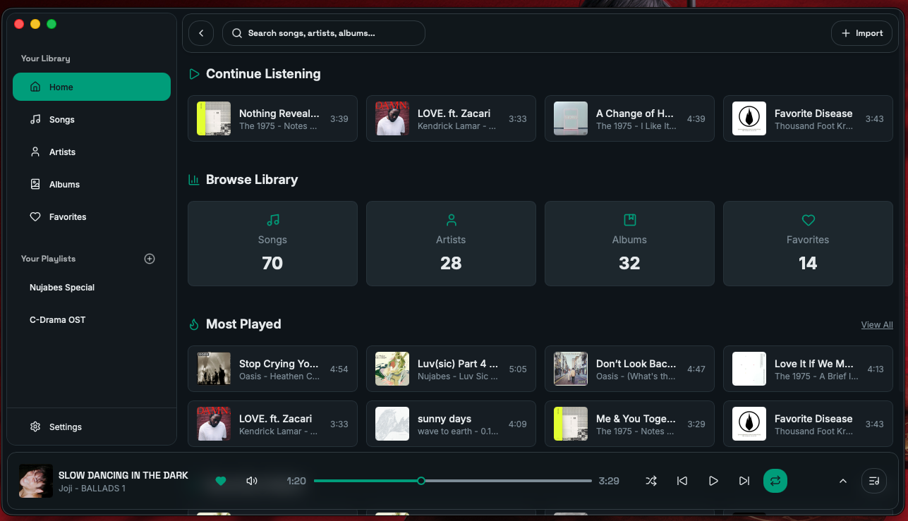
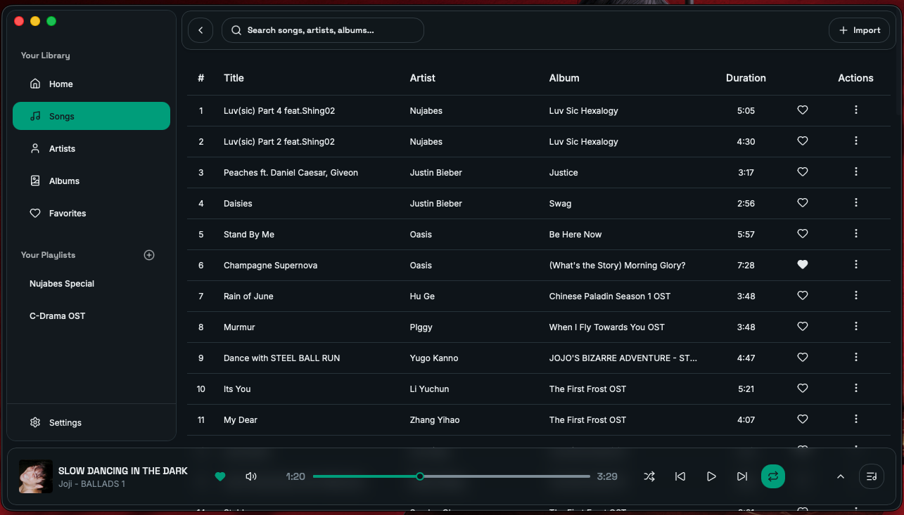
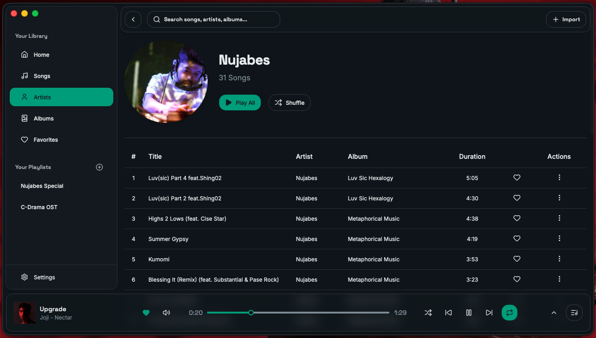
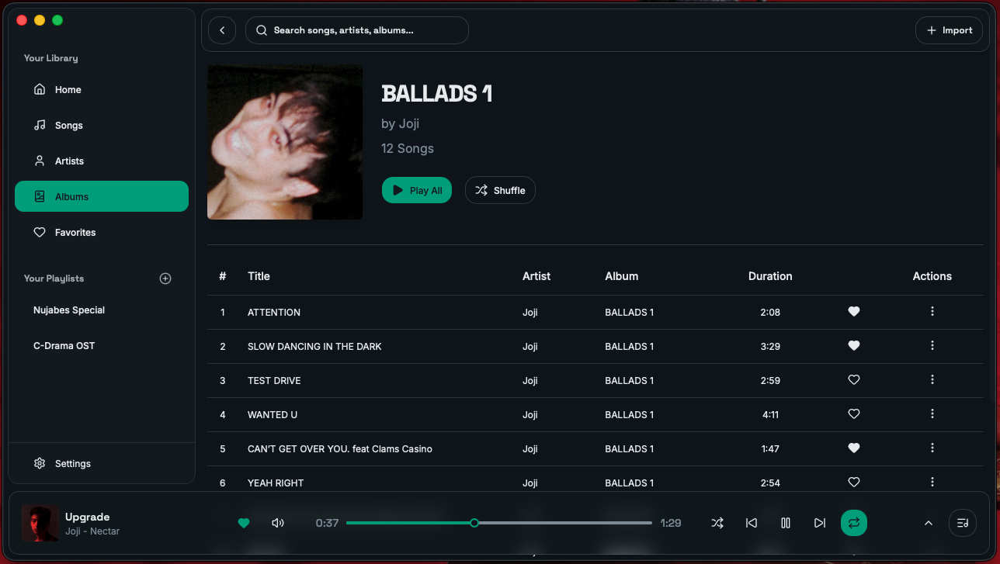
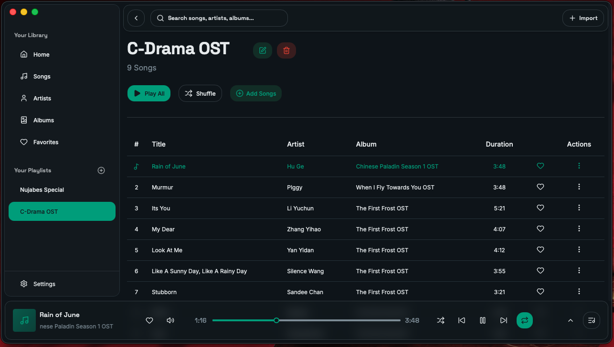
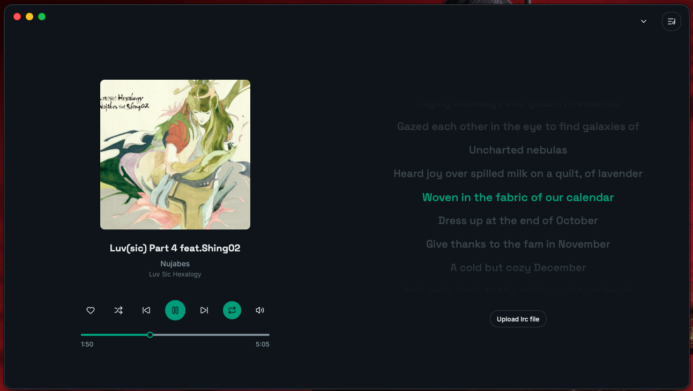
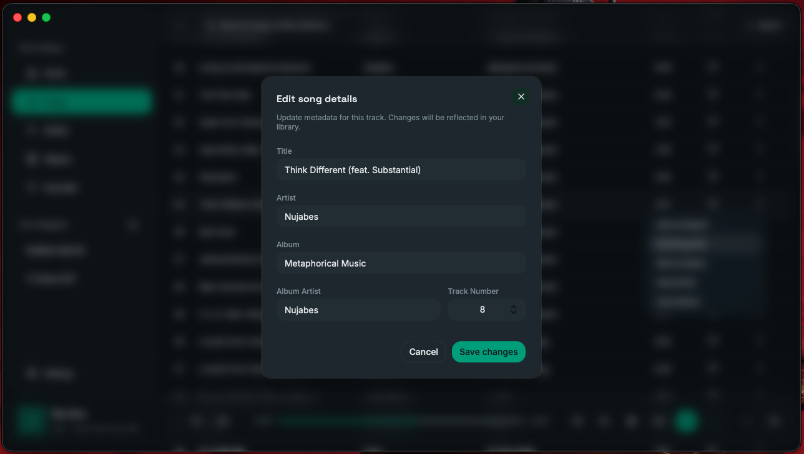

  

<h1 align="center">Sonara</h1>

  <b>A sleek, lightweight desktop music player built with Tauri + React</b>

  Fast. Local-first. Distraction-free.

  
  
  

 

## ✨ A modern, local-first music experience

Sonara is designed for people who want **speed, simplicity, and full control over their local music library**.

No streaming clutter. No ads. Just your music.

 

## App Experience

Instead of pages, Sonara is designed as a **music flow experience**.

### 🎧 Library (Home)

Your complete local music collection in one place.

- Fast browsing
- Instant playback
- Clean UI

 

 

### 👤 Artists

Discover songs grouped by artist with rich metadata.

- Artist images
- Album grouping
- Clean navigation

 

### 💿 Albums

Explore music grouped by albums with automatic or custom artwork.

- Auto-fetch album covers
- Manual cover upload support
- Cached for fast loading

  
 

### ⭐ Playlists

- Personal music organization and queue management.

 

### 🎵 Playback & Lyrics

A focused listening experience with synced lyrics.

- LRCLIB integration
- Smooth playback UI
- Real-time lyric sync

 

### ✏️ Metadata Editor

Edit your music metadata directly inside the app.

- Edit song, album, artist info
- Stored locally (no file modification)
- Safe and reversible

 

## ✨ Features

- ⚡ Lightning fast local music scanning

- 🎨 Album & artist artwork system

- 📝 Synced lyrics support

- ✏️ Editable metadata (local-only)

- 📁 Smart library organization

- 🔒 Privacy-first (no accounts, no tracking)

 

## ⚙️ How It Works

- Music folders are scanned locally

- Metadata is stored in SQLite

- React handles UI + playback state

- Rust (Tauri) powers performance & system access

- External APIs enhance artwork + lyrics

 

> “Your music should belong to you — not a platform.”

Sonara is built around **local-first, privacy-focused music playback**. No accounts. No tracking. No ads.

 

## 📄 License

MIT License © 2026 Sonara

 Made with ❤️ using Rust + Tauri + React 

